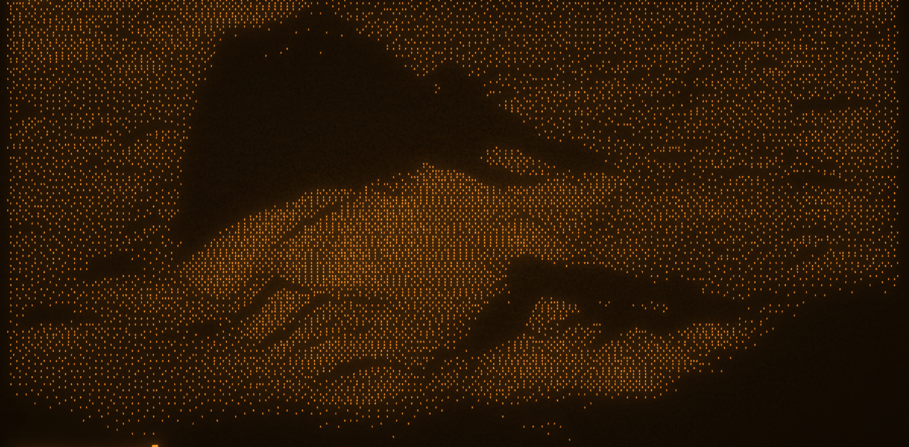
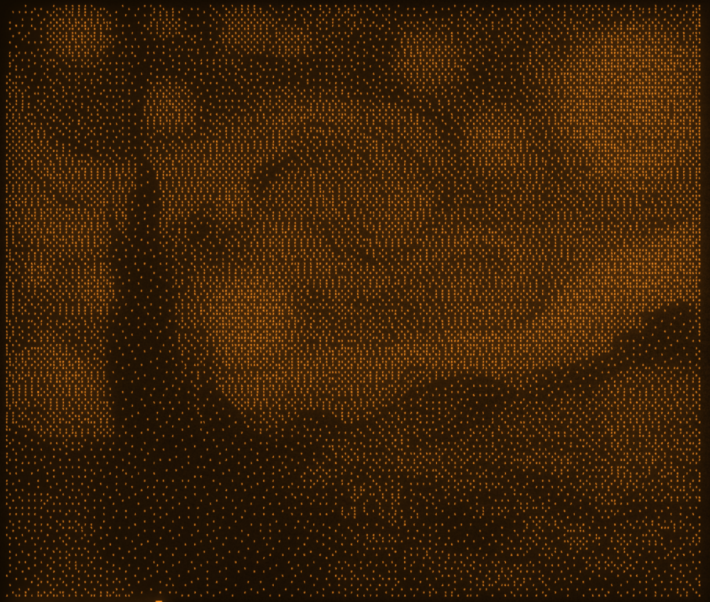
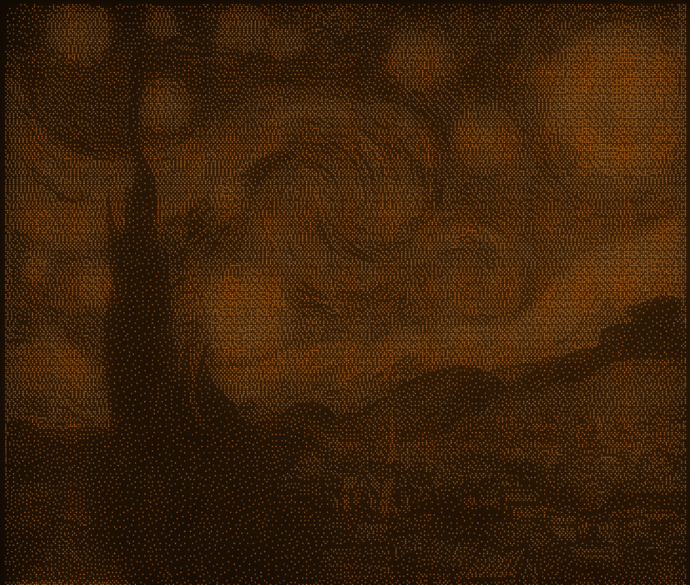

# Rust app to display images in a terminal

Size ajusts to the terminal's size per default but can be changed

The example renders are displayed in [cool_retro_term](https://github.com/Swordfish90/cool-retro-term)